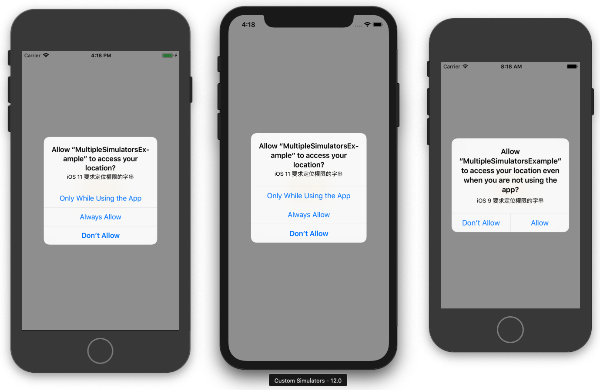

# MultipleSimulatorsExample
<a href="https://medium.com/@tobyhsu/xcode-%E4%B8%80%E6%AC%A1%E7%B7%A8%E8%AD%AF%E5%95%9F%E5%8B%95%E5%A4%9A%E5%80%8B%E6%A8%A1%E6%93%AC%E5%99%A8-8336ae2be245">[Xcode] 一次編譯啟動多個模擬器</a>
## Demo

